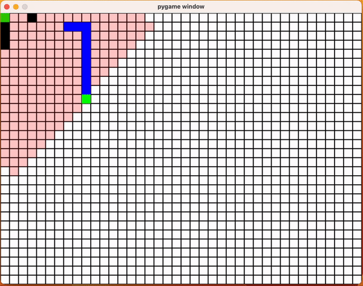
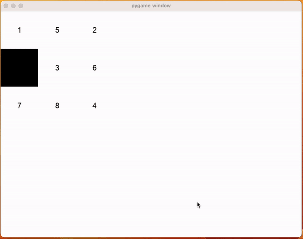
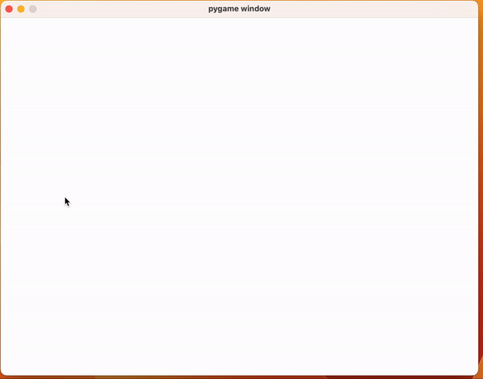

# Heuristic Problems
Using heuristic search on different domains. see how to [simulate](simulate) these domains.

# Domains

## Pathfinding

## Tile Puzzles

## Graph Pathfinding

# To Do:

All due by Nov 26th
- [ ] Confirm Heuristics work - tweak random experiments and confirm somehow - Samad - Nov 23
- [ ] Set up Heuristic Experiments - evaluate node expansions, cost for each heuristic - Samad - Nov 24
- [ ] Try WA* with Best Heuristic - Samad - Nov 25
- [ ] Try IDA*, GBFS, and eGBFS - Suren
- [ ] Set up aggression Experiments - 0.25, 0.5, 0.75, 1 - Samad - Nov 25

- [ ] Set up visualization of all the experiments - Suren